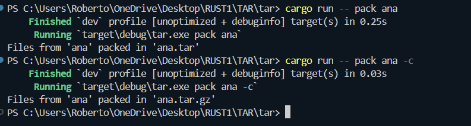

# TAR: Custom Archiver CLI in Rust

**Author:** RobertoSpy

---

## Overview

This repository contains a set of Rust lab assignments and a final project: **TAR**, a custom archiver CLI tool written in Rust. The TAR project allows you to pack and unpack files and directories into `.tar` or `.tar.gz` archives, similar to the Unix `tar` utility, but implemented manually for learning purposes.

---

## TAR Project Functionality

### Main Features

- **Pack files/folders:**  
  Groups files and directories into a `.tar` archive, following the TAR file format specification.
- **Gzip compression:**  
  Optionally compresses the `.tar` archive into `.tar.gz` using the `flate2` library.
- **Unpack archives:**  
  Extracts the contents of `.tar` or `.tar.gz` archives, restoring the original file structure.
- **Manual TAR header creation:**  
  Builds the TAR file headers by hand, handling name, size, type, and checksum as per the spec.
- **Recursive directory packing:**  
  Supports packing nested directories and files.
- **Padding management:**  
  Ensures file blocks are correctly padded to 512 bytes, as required by TAR.
- **CLI interface:**  
  Simple commands for packing and unpacking with argument parsing.

 ---

 
  ## How It Works

### Packing (`pack` command)

- **Algorithm:**  
  - Traverse the given folder (recursive).
  - For each file/directory, create a TAR header (with proper name, size, type flag, and checksum).
  - Write header and content to a buffer.
  - Pad each file to 512 bytes.
  - After all files are processed, write the buffer to a `.tar` file.
  - If compression is requested (`-c`), compress the buffer with Gzip and write a `.tar.gz` file.

- **Example usage:**
  ```bash
  cargo run -- pack my_folder
  cargo run -- pack my_folder -c
  ```

### Unpacking (`unpack` command)

- **Algorithm:**  
  - Read the archive file (`.tar` or `.tar.gz`).
  - If Gzip, decompress first.
  - Parse each header block (512 bytes).
  - Extract file information: name, size, type.
  - Write files/directories to output location, recreating original structure.
  - Handles padding and directory creation.

- **Example usage:**
  ```bash
  cargo run -- unpack my_folder.tar
  cargo run -- unpack my_folder.tar.gz
  ```
---

  ### Key Implementation Details

- **TAR header creation:**  
  - Custom function `create_tar_header(name, size)` builds the 512-byte header, encoding the filename, size (octal), typeflag, and checksum.
- **Recursive packing:**  
  - Function traverses directories, adds headers for folders (`typeflag '5'`) and files (`typeflag '0'`).
- **Padding:**  
  - Function `padd(data)` ensures each content chunk aligns to 512 bytes.
- **Compression:**  
  - Uses the `flate2` crate for Gzip support.
- **Unpacking:**  
  - Parses headers, extracts file info, and writes to disk. Handles errors for missing files, invalid paths or corrupted archives robustly.

---

## How to Run

1. **Install Rust:**  
   [https://rustup.rs/](https://rustup.rs/)
2. **Clone the repo and go to TAR folder:**  
   ```bash
   cd TAR
   ```
3. **Build the project:**  
   ```bash
   cargo build --release
   ```
4. **Run commands as shown above.**
 **Note:**  
Requires [flate2 crate](https://docs.rs/flate2/) for Gzip compression (already included in `Cargo.toml`).


   ---

   ## Screenshots

- 
- 
- Notice how `.tar.gz` is smaller due to compression.

  ## Contact

For questions or collaboration:  
[robertoissues@gmail.com](mailto:robertoissues@gmail.com)
